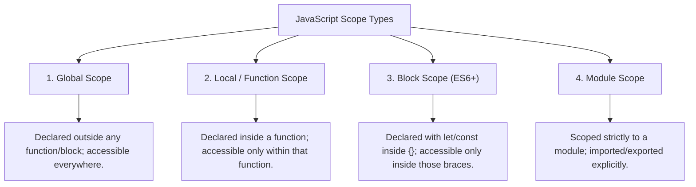
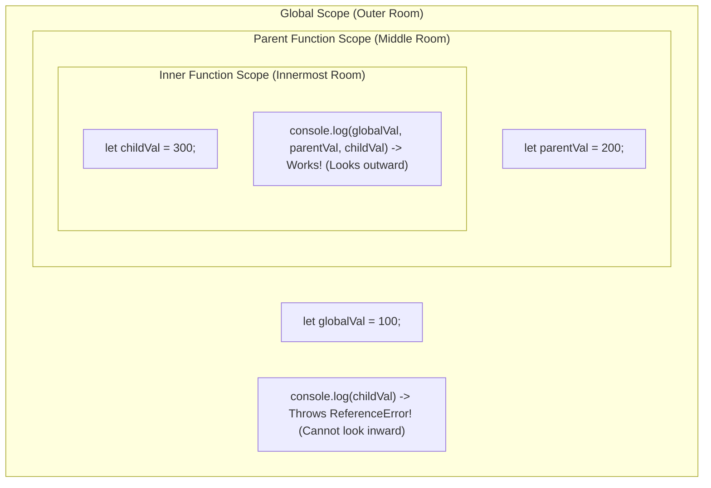

# JavaScript Scoping & Lexical Scope: Interview Preparation Guide

This comprehensive guide covers scoping, static (lexical) scope, execution contexts, closures, hoisting, strict mode, and browser-specific scopes (Global/Window vs. Script Scope) for technical interviews.

---

## Table of Contents
1. [What is Scope?](#1-what-is-scope)
2. [Deep Dive: Types of Scope](#2-deep-dive-types-of-scope)
3. [Advanced Scope Concepts](#3-advanced-scope-concepts)
4. [Scope vs. Lexical Scope: The Core Difference](#4-scope-vs-lexical-scope-the-core-difference)

---

## 1. What is Scope?

**Scope** determines the accessibility and visibility of variables, functions, and objects in certain regions of your code during runtime.
* **Analogy:** Scope represents the boundary lines of your code. Inside the boundary, variables are recognized and alive; outside the boundary, they cannot be seen or accessed.
* In JavaScript, scope controls both the **visibility** (where it can be used) and the **lifetime** (how long it exists in memory) of a variable.



---

## 2. Deep Dive: Types of Scope

### A. Global Scope
Variables declared outside of any function or block possess global scope. 
* When the JavaScript engine runs a script, it creates a **Global Execution Context** and allocates these variables there.
* They are accessible from **anywhere** in your program.

```javascript
let a = "Hi"; // Global variable, defined outside any function or block

function Hi() {
  console.log("say", a); // Accessible inside functions
}
Hi();
console.log(a); // Accessible in the global scope
```

---

### B. Local / Function Scope
Variables declared inside a function are function-scoped (or locally scoped).
* Whether declared using `var`, `let`, or `const`, they are confined to that function's execution context.
* They **cannot** be accessed from outside the function.

```javascript
function say() {
  var mes = "Hi,"; // 'mes' is function-scoped (local)
  console.log(mes);
}
say();

// Attempting to access 'mes' outside results in a ReferenceError
// console.log(mes); // Uncaught ReferenceError: mes is not defined
```

---

### C. Block Scope (introduced in ES6)
A block is defined by a pair of curly braces `{}`. This includes code blocks inside `if` statements, `else` branches, `switch` cases, and loops (`for`, `while`, `do-while`).
* Variables declared with **`let`** and **`const`** inside a block are block-scoped and cannot be accessed outside the block.
* **`var` does NOT support block scope**—it ignores curly braces and leaks (spills) into the enclosing function or global scope.

```javascript
function block() {
  let b = "Hello";
  if (true) {
    let c = "bye";
    console.log(b + c); // Outputs: "Hellobye" (both are visible here)
  }
  // console.log(b + c); // Throws ReferenceError: c is not defined
}
block();
```

---

### D. Browser-Specific: Global Scope vs. Script Scope

In browser environments, there is a distinct separation between variables attached directly to the global window object and variables that stay in script scope.

| Scope Type | Browser Global / Window Scope | Script Scope |
| :--- | :--- | :--- |
| **Declaration** | Variables declared with `var` or functions declared at the top-level outside functions. | Variables declared with `let` or `const` at the top-level outside functions. |
| **Window Object** | **Attached** as properties on the global `window` object (e.g., `window.myVar`). | **Not attached** to the global `window` object. |
| **Accessibility** | Globally accessible by any script loaded on the page. | Globally accessible by any script loaded on the page. |
| **Pollution** | Pollutes the global `window` namespace (risking name collisions). | Keeps the `window` object clean. |

```javascript
// Run at the top-level of a browser script:
let m = "Hi";
var d = "GoodBye";

console.log(window.d); // "GoodBye" (var goes to Global/Window scope)
console.log(window.m); // undefined (let stays in Script scope)

function display() {
  const n = "Hello";
  let s = "bye";
  if (true) {
    console.log(m + n + s); // "HiHelloScale" (accessing script-scoped 'm')
  }
  console.log(m + d); // "HiGoodBye"
}
display();
```

---

### E. Module Scope
In modern ES6 JavaScript modules (`<script type="module">` or files using `import`/`export`), variables declared at the top level are **scoped to that module file only**.
* They do not pollute the global scope or script scope.
* They can only be accessed in other files if explicitly `export`ed and `import`ed.

```javascript
// module.js
export const moduleScopedVar = "I am module-scoped";

// main.js
import { moduleScopedVar } from "./module.js";
console.log(moduleScopedVar); // "I am module-scoped"
```

---

## 3. Advanced Scope Concepts

### A. Variable Hoisting
* **`var` Hoisting:** Declarations are hoisted to the top of their scope and initialized with `undefined`.
* **`let` & `const` Hoisting:** Declarations are hoisted but **not initialized**. They enter the Temporal Dead Zone (TDZ). Accessing them before initialization throws a `ReferenceError`.

```javascript
console.log(name); // var is hoisted, outputs: undefined
var name = "vishal";

// console.log(lastName); // Throws ReferenceError: Cannot access 'lastName' before initialization
let lastName = "shinde";
```

### B. Closures
A **closure** is the combination of a function bundled together with references to its surrounding state (the **lexical environment**). In other words, a closure gives an inner function access to the outer function's scope even after the outer function has finished executing.

```javascript
function outerFunction(outerVariable) {
  return function innerFunction(innerVariable) {
    console.log('Outer Variable: ' + outerVariable);
    console.log('Inner Variable: ' + innerVariable);
  }
}
const newFunction = outerFunction('outside');
newFunction('inside'); // Still remembers 'outerVariable'!
```

### C. Strict Mode (`"use strict"`)
Strict mode restricts certain JavaScript behaviors to make your code more secure and prevent bugs.
* **Implicit Globals:** Without strict mode, assigning a value to an undeclared variable (e.g., `x = 10`) implicitly creates a global variable. In strict mode, this throws a `ReferenceError`.

---

## 4. Scope vs. Lexical Scope: The Core Difference

### A. The Basic Definitions
* **Scope:** The actual **runtime environment or box** where a variable is stored and can be accessed.
* **Lexical Scope (Static Scope):** The **ruleset** that dictates *how* nested scopes look up variables. "Lexical" means "relating to the written source code". Therefore, lexical scope means variable access is decided by **where variables and functions are physically written in the code**, not where they are executed.

---

### B. The "One-Way Mirror" Analogy
Think of nested functions as a series of nested rooms with one-way mirrors:
1. **Looking Outward (Allowed):** If you are in the innermost room (inner function), you can look out through the mirror and see variables in the outer rooms (parent functions and global scope).
2. **Looking Inward (Blocked):** Someone in the outer room (global/parent scope) cannot look into the inner room. They cannot see or access variables inside the inner function.



---

### C. The Ultimate Interview Test: "Written Place" vs. "Called Place"

To understand Lexical Scope, look at the classic interview question below. Try to predict what is printed:

```javascript
let x = 10;

function first() {
  console.log(x); 
}

function second() {
  let x = 20;
  first(); // Calling first() from inside second()
}

second();
```

#### What is printed? `10` or `20`?
* **Answer:** `10`.
* **Why?** JavaScript uses **Lexical Scope** (Static Scope). When the JS engine looks for `x` inside the `first()` function, it doesn't care where `first()` was *called* (inside `second()`). It only cares where `first()` was *defined* (written).
* Since `first()` was defined in the Global Scope, its parent scope is the Global Scope, where `x` is `10`.

```mermaid
graph TD
    subgraph DefinitionTime["Lexical Structure (Definition/Write-Time)"]
        G["Global Scope <br> let x = 10"]
        G --> F["first() <br> Parent is Global Scope"]
        G --> S["second() <br> let x = 20"]
    end
    
    subgraph RuntimeExecution["Runtime Resolution Flow"]
        CallSecond["second() is invoked"] --> CallFirst["Calls first()"]
        CallFirst --> RunFirst["Runs console.log(x) inside first()"]
        RunFirst --> LookupDefinition["Looks up scope chain of first's definition (Global)"]
        LookupDefinition --> FoundX["Finds x = 10 (Global) <br> Outputs: 10"]
        
        RunFirst -.x |"Does NOT look at calling environment (second)"| S
    end
```

If JavaScript had *Dynamic Scope* (which it does not!), the engine would resolve `x` based on where the function was called, printing `20`. Because it uses *Lexical Scope*, it resolves `x` based on where it was defined, printing `10`.

---

### D. Detailed Comparison Table

| Feature | Scope (General Concept) | Lexical Scope (Specific Ruleset) |
| :--- | :--- | :--- |
| **What is it?** | The **boundary/box** containing variables at runtime. | The **lookup rules** based on where the code was written. |
| **When is it set?** | Activates and is instantiated at **runtime** when code executes. | Fixed at **compile-time** (when you write the code). |
| **Dynamic or Static?** | Can have dynamic variables inside active context frames. | **Always static**. The nesting hierarchy never changes. |
| **Direction** | Holds local variables. | Dictates that lookup goes **outward** (inner to outer). |
| **How it's used** | Manages memory execution contexts. | Allows the creation of **closures** (functions remembering parent variables). |
