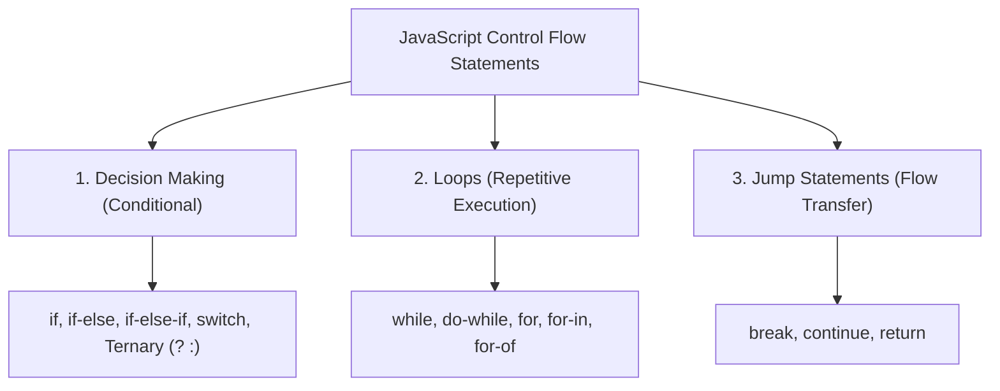
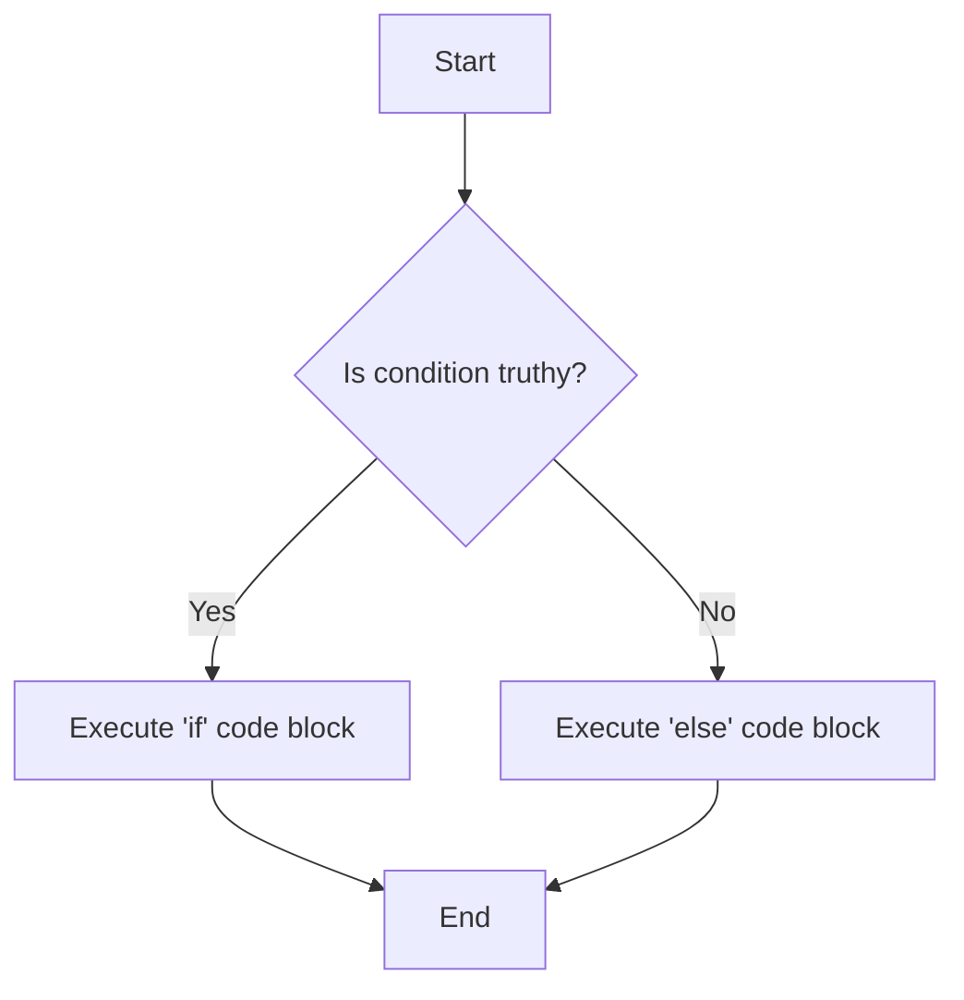
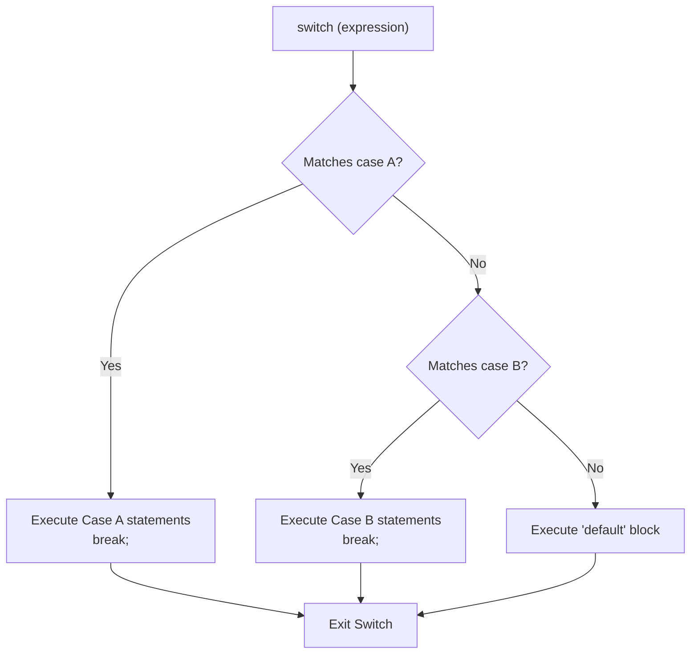
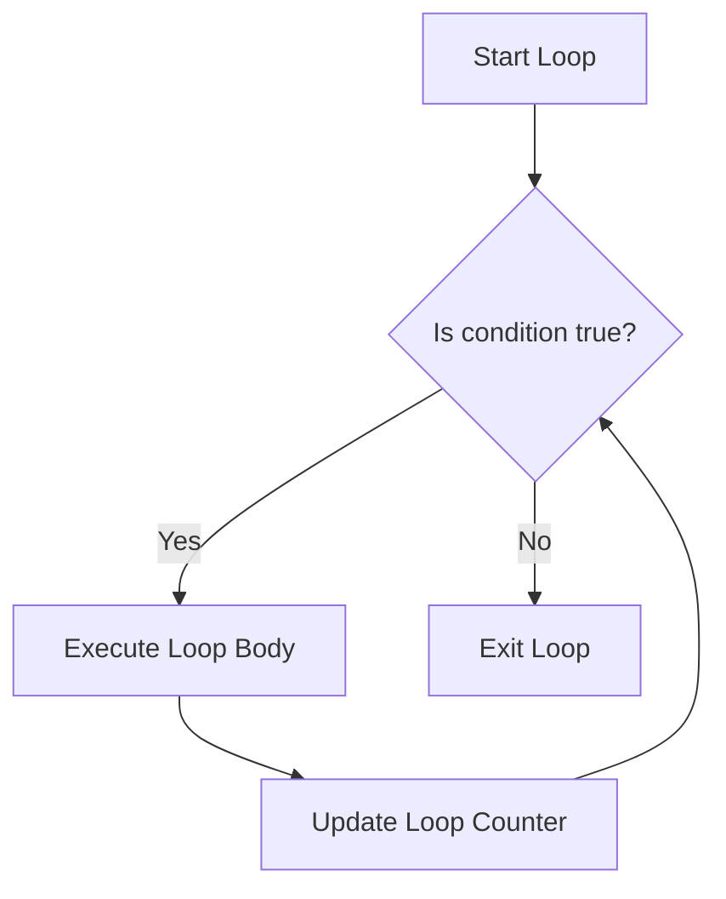
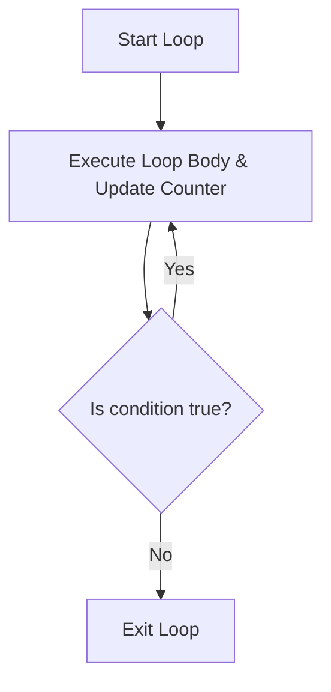

# JavaScript Control Flow: Interview Preparation Guide

This guide covers JavaScript control flow statements, including conditional decision-making (`if`, `if-else`, `switch`, ternary), loops (`while`, `do-while`, `for`, `for-in`, `for-of`), and jump statements (`break`, `continue`, `return`), enriched with diagrams and code examples.

---

## Table of Contents
1. [What is Control Flow?](#1-what-is-control-flow)
2. [Decision Making (Conditional) Statements](#2-decision-making-conditional-statements)
3. [Loop Statements](#3-loop-statements)
4. [Jump Statements](#4-jump-statements)

---

## 1. What is Control Flow?

In JavaScript, **Control Flow** is the order in which individual statements, instructions, or function calls are executed. Control statements allow you to alter this flow based on specified conditions.



---

## 2. Decision Making (Conditional) Statements

Conditional statements evaluate boolean expressions to decide which block of code to execute.

---

### A. The `if` and `if-else` Statements
* **`if`:** Evaluates a condition. If the condition is truthy, it executes the code block inside `{}`.
* **`if-else`:** If the condition is truthy, the `if` block executes. If falsy, the `else` block executes.



#### Example:
```javascript
var tomorrow = "rain";

if (tomorrow === "rain") {
  console.log("TAKE A RAINCOAT"); // Executes if condition is true
} else {
  console.log("NO NEED TO RAINCOATS"); // Executes if condition is false
}
```

---

### B. Nested `if-else`
An `if-else` statement written inside another `if` or `else` block. It is used to perform deeper conditional checks.

#### Interview Problem: Leap Year Checker
A leap year has exactly 366 days. It is divisible by 4 and by 400, but **not** divisible by 100 (unless it is also divisible by 400).

```javascript
var year = 2000;

if (year % 4 === 0 && year % 400 === 0) {
  // Nested if-else check
  if (year % 100 !== 0) {
    console.log("GIVEN YEAR NOT LEAP YEAR");
  } else {
    console.log("GIVEN YEAR IS LEAP YEAR");
  }
} else {
  console.log("GIVEN YEAR IS NOT LEAP YEAR..!");
}
```

---

### C. The `if-else-if` (Else-If Ladder)
Used to evaluate multiple conditions sequentially. JavaScript stops checks as soon as the first truthy condition is encountered. If none are truthy, the final `else` block is run.

```javascript
var name = "vishal";
var age = 20;

if (name === "vishal" && age === 27) {
  console.log("THIS IS NOT ACCURATE AGE");
} else if (name === "shinde" && age === 20) {
  console.log("THIS IS NOT VISHAL");
} else if (name === "vishal" && age === 20) {
  console.log("GIVEN DATA IS VISHAL'S DATA"); // Output: GIVEN DATA IS VISHAL'S DATA
} else {
  console.log("INVALID DATA !");
}
```
> [!IMPORTANT]
> In an else-if ladder, only the **first** logical block that evaluates to `true` is executed. Any subsequent truthy conditions are skipped.

---

### D. The `switch` Statement
Evaluates an expression, matching its resolved value against a series of `case` clauses. When a match is found, the statements inside that case are executed.



#### Example: Shape Area Calculator
```javascript
var area = 'circle';
const pi = 3.14;
var length = 10;
var width = 20;
var radius = 10;

switch(area) {
    case 'circle':
        const areaCircle = pi * (radius ** 2);
        console.log('AREA OF CIRCLE', areaCircle); // Output: AREA OF CIRCLE 314
        break;
    case 'triangle':
        const triangle = (length * width) / 2;
        console.log(triangle);
        break;
    default:
        console.log('NO DATA');
}
```

#### Why use `break` in a `switch` statement?
> **Answer:** The `break` statement is used to exit the switch block immediately. If omitted, execution falls through to the next case (known as **fall-through**), running subsequent cases regardless of whether they match the expression.

---

### E. The Ternary (Conditional) Operator (`? :`)
A concise, inline expression shorthand for a simple `if-else` statement. It takes three arguments:
$$\text{variable} = \text{(condition)} \ ? \ \text{valueIfTrue} \ : \ \text{valueIfFalse}$$

#### 1. Simple Ternary:
```javascript
var age = 20;
var voteStatus = age > 18 ? "ELIGIBLE FOR VOTE" : "NOT ELIGIBLE FOR VOTE";
console.log("VOTER STATUS: ", voteStatus); // Output: VOTER STATUS: ELIGIBLE FOR VOTE
```

#### 2. Chained Ternary (Multiple Nested Conditions):
```javascript
const isMember = true;
const isStudent = false;
const price = isMember ? (isStudent ? "5 USD" : "10 USD") : "15 USD";
console.log(price); // Output: 10 USD
```

#### 3. String Status Mapping:
```javascript
const status = "offline";
const message =
  status === "online"
    ? "You are online"
    : status === "away"
    ? "You are away"
    : status === "offline"
    ? "You are offline"
    : "Unknown status";

console.log(message); // Output: You are offline
```

#### 4. Time Range Greeting:
```javascript
const time = 13;
const greeting =
  time < 12 ? "Good Morning" : time < 18 ? "Good Afternoon" : "Good Evening";

console.log(greeting); // Output: Good Afternoon
```

---

## 3. Loop Statements

Loops repeat a block of code while a specified condition is true, allowing you to run instructions iteratively.

---

### A. The `while` Loop (Entry-Controlled Loop)
* Repeats code as long as the condition remains true.
* The condition is evaluated **before** entering the loop. If the condition is false initially, the loop body is never executed.
* **Best used:** When the number of iterations is **not known** beforehand.



#### Example 1: Basic Counter
```javascript
let n = 0;
while (n <= 10) {
    console.log(n);
    n++;
} // Output: 0, 1, 2, 3, 4, 5, 6, 7, 8, 9, 10
```

#### Example 2: Multiplication Table of 5
```javascript
let no = 1;
while (no <= 10) {
  console.log("5 * " + no + " = " + (5 * no));
  no++;
}
```
> [!CAUTION]
> If the loop condition never evaluates to `false` (e.g. forgot to increment counter `no++`), the loop runs infinitely, which can freeze or crash the execution environment.

---

### B. The `do-while` Loop (Exit-Controlled Loop)
* Executes the code block **at least once** before checking the condition.
* The condition is evaluated **at the end** of the loop body.
* **Best used:** When the loop must execute at least once regardless of the condition.



#### Example 1: Basic Counter
```javascript
var num = 0;
do {
    console.log(num);
    num++;
} while (num <= 10);
```

#### Example 2: Safe Positive User Input (Corrected Syntax)
```javascript
let userInput;
let positiveNumber;

do {
  userInput = prompt('Enter any positive number:');
  positiveNumber = parseFloat(userInput);
} while (isNaN(positiveNumber) || positiveNumber < 0);

console.log('You entered a valid positive number: ', positiveNumber);
```

---

### C. While vs. Do-While: The Differences

| Feature | `while` Loop | `do-while` Loop |
| :--- | :--- | :--- |
| **Control Type** | **Entry-controlled** (checks condition first). | **Exit-controlled** (checks condition last). |
| **Minimum Executions**| `0` (runs zero times if condition is initially false). | `1` (always executes at least once). |
| **Use Case** | When iterations are unknown and safety check is required first. | When loop body must run at least once (e.g. user prompts). |
| **Initialization** | Counter must be initialized before the loop. | Counter initialized before or inside the loop. |

---

### D. The `for` Loop (Fixed Iterations Loop)
Repeats code for a **fixed or known number of times**. It bundles initialization, condition checking, and step updating into a single line.
$$\text{for (initialization; condition; increment/decrement)}$$

* **Execution Order:**
  1. **Initialization:** Runs once at start.
  2. **Condition:** Checked before each iteration. If falsy, exits.
  3. **Body:** Runs if condition is truthy.
  4. **Increment/Decrement:** Runs after each body execution, then loops back to step 2.

```javascript
for (let i = 1; i <= 5; i++) {
    console.log(i); // Output: 1, 2, 3, 4, 5
}
```

#### 1. How to create an Infinite For Loop:
Omitting the statements `for (;;)` creates a loop that runs forever.
```javascript
// for (;;) {
//   console.log('done'); // Infinite loop
// }
```

#### 2. Interview Problem: Prime Number Checker
Checks if a number has only two divisors: 1 and itself.
```javascript
let primeNum = 7;
let isPrime = true;

for (let i = 2; i < primeNum; i++) {
    if (primeNum % i === 0) {
        isPrime = false;
        break; // Stop loop once divisor is found
    }
}

if (isPrime) {
    console.log(primeNum + ' is a prime number');
} else {
    console.log(primeNum + ' is not a prime number');
}
```
---

### E. The `for-in` Loop (Object Keys & Property Iterator)
Iterates over the **enumerable property keys** of an object or the indices of an array.
* **Returns:** String keys representing properties.
* **Prototype gotcha:** It iterates over inherited enumerable properties from the prototype chain as well!
* **Array gotcha:** It is generally discouraged to use `for...in` on arrays because indices are returned as strings (`"0"`, `"1"`) and order of iteration is not guaranteed.

```javascript
const userObj = {
   vishal: 20,
   akshay: 40,
   vinay: 50,
   ak: 90
};

for (let key in userObj) {
   console.log(key); // Output: "vishal", "akshay", "vinay", "ak"
}
```

#### Use Case 1: Counting Character Frequencies (Object as a Hash Map)
We use `for...in` to inspect and log character frequencies counted in a dictionary.
```javascript
const text = "javascript";
const charCount = {};

for (let char of text) {
  charCount[char] = (charCount[char] || 0) + 1;
}

// Using for-in to print counts
for (let key in charCount) {
  console.log(`${key} appears ${charCount[key]} times`);
}
```

#### Use Case 2: Object Filtering (Finding Active Users)
We loop through a user database object to find keys matching a condition.
```javascript
const userAges = { vishal: 27, akshay: 17, vinay: 20 };
const adultUsers = [];

for (let name in userAges) {
  if (userAges[name] >= 18) {
    adultUsers.push(name);
  }
}
console.log(adultUsers); // ["vishal", "vinay"]
```

#### Use Case 3: The Prototype Inherited Properties Gotcha (Crucial for Interviews)
```javascript
// Base prototype property
Object.prototype.globalTheme = "dark";

const localSettings = { language: "en" };

// Prints both 'language' AND inherited 'globalTheme'!
for (let key in localSettings) {
  console.log(key); // Output: "language", then "globalTheme"
}

// Safe check: Only print own properties
for (let key in localSettings) {
  if (Object.hasOwn(localSettings, key)) {
    console.log(key); // Output: "language" only
  }
}
```

---

### F. The `for-of` Loop (Iterable Values Iterator)
Iterates over the **values** of an **iterable object** (such as Arrays, Strings, Maps, Sets, or custom Generators).
* **Returns:** Direct values.
* **Standard objects:** Standard objects are **not iterable** (lack `[Symbol.iterator]`), so `for...of` will throw a `TypeError`.

#### 1. Iterating Strings:
```javascript
for (let char of "vishal") {
    console.log(char); // Output: "v", "i", "s", "h", "a", "l"
}
```

#### 2. Handling Objects (Throws error if run directly):
```javascript
const objSample = { vishal: 20, akshay: 40 };

// for (let val of objSample) {} // TypeError: objSample is not iterable
```

#### 3. Accessing Object Values using helper methods:
Use `Object.values(obj)` to extract values, or `Object.entries(obj)` for key-value arrays.
```javascript
// Extracting only values:
for (let val of Object.values(objSample)) {
    console.log(val); // Output: 20, 40
}

// Extracting keys and values:
for (const [key, value] of Object.entries(objSample)) {
    console.log(key, value); 
    // Output: 
    // "vishal" 20
    // "akshay" 40
}
```

#### Use Case 1: Iterating a Map (Key-Value Pairs)
```javascript
const userRoles = new Map([
  ["vishal", "admin"],
  ["akshay", "editor"]
]);

for (const [user, role] of userRoles) {
  console.log(`${user} is an ${role}`);
}
```

#### Use Case 2: Deduplicating and Summing an Array (using Set)
```javascript
const scores = [10, 20, 10, 30, 20];
const uniqueScores = new Set(scores); // [10, 20, 30]
let totalScore = 0;

for (let score of uniqueScores) {
  totalScore += score;
}
console.log(totalScore); // 60 (10 + 20 + 30)
```

#### Use Case 3: Array Object Destructuring On-The-Fly
```javascript
const employees = [
  { name: "Vishal", salary: 5000 },
  { name: "Akshay", salary: 6000 }
];

for (const { name, salary } of employees) {
  console.log(`${name} earns $${salary}`);
}
```

---

### G. For-In vs. For-Of Comparison: Deep Dive

#### 1. Quick Summary Table:
| Feature | `for...in` Loop | `for...of` Loop |
| :--- | :--- | :--- |
| **Primary Target** | **Keys** (property names of objects, indices of arrays) | **Values** of iterable data structures |
| **Target Type** | Any Object (works on both iterables and non-iterables) | Iterable structures only (`Array`, `String`, `Map`, `Set`, `NodeList`) |
| **Value Resolution**| Returns keys/indices as **Strings** (e.g., `"0"`, `"1"`) | Returns values in their **original data types** |
| **Prototype Inheritance**| Walks the prototype chain and loops **inherited properties** | Ignores the prototype chain entirely |
| **Custom Property Gotcha**| Loops over non-numeric custom properties added to arrays | Ignores custom properties added to arrays |
| **Order Guarantee** | Not guaranteed (may vary by JS engine or property types) | Guaranteed (respects the sequence of the collection) |
| **Performance** | Slower (due to walking prototype chain properties) | Faster (uses optimized iterator protocol `[Symbol.iterator]`) |

---

#### 2. The 4 Critical Difference Use Cases (Interview Highlights)

##### Difference A: Keys vs. Values (The Core Difference)
* `for...in` returns keys/indexes.
* `for...of` returns the actual values.

```javascript
const fruits = ["apple", "banana", "orange"];

// for-in: returns indices (as string keys)
for (let key in fruits) {
  console.log(key, typeof key); 
  // Output: 
  // "0" "string"
  // "1" "string"
  // "2" "string"
}

// for-of: returns values directly (in original types)
for (let val of fruits) {
  console.log(val, typeof val);
  // Output: 
  // "apple" "string"
  // "banana" "string"
  // "orange" "string"
}
```

##### Difference B: Array Custom Properties Leak (Crucial Interview Trap)
If someone adds a custom string property to an array, `for...in` will erroneously output it, whereas `for...of` will correctly ignore it.

```javascript
const nums = [10, 20];
nums.customKey = "leak"; // Adding a custom property to the array object

// for-in leaks custom properties!
for (let index in nums) {
  console.log(index); // Output: "0", "1", "customKey" (Oops!)
}

// for-of only loops index values
for (let val of nums) {
  console.log(val); // Output: 10, 20 (Correct!)
}
```

##### Difference C: Prototype Chain Inheritance
`for...in` travels up the object's prototype chain and lists all enumerable properties found there. `for...of` only cares about the iterable collection's items.

```javascript
Object.prototype.sharedOption = "globalTheme";
const userSetting = { theme: "light" };

// for-in lists inherited prototype property
for (let key in userSetting) {
  console.log(key); // Output: "theme", "sharedOption"
}

// for-of ignores prototype chain when iterating collections
const iterableValues = ["light"];
for (let val of iterableValues) {
  console.log(val); // Output: "light"
}
```

##### Difference D: Standard Object Iteration
Standard objects cannot be used with `for...of` because they lack the `[Symbol.iterator]` property.

```javascript
const employee = { name: "Vishal", role: "admin" };

// for-in: Works perfectly
for (let key in employee) {
  console.log(key, employee[key]); // "name Vishal", "role admin"
}

// for-of: Crashes!
try {
  for (let val of employee) {
    console.log(val);
  }
} catch (err) {
  console.log(err.message); // Output: "employee is not iterable"
}
```

---

## 4. Jump Statements

Jump statements immediately transfer control to another section of the program.

---

### A. The `break` Statement
Exits the nearest enclosing loop (`for`, `while`, `do-while`) or `switch` block, moving execution to the next line outside the block.

```javascript
for (let i = 0; i < 10; i++) {
  if (i === 5) {
    break; // Exits the loop entirely
  }
  console.log(i); // Logs: 0, 1, 2, 3, 4
}
```

---

### B. The `continue` Statement
Skips the rest of the statements in the **current iteration** of the loop and jumps directly to the loop condition evaluation (or step update) for the next iteration.

```javascript
for (let i = 0; i < 10; i++) {
    if (i === 5) {
        continue; // Skips logging 5
    }
    console.log(i); // Logs: 0, 1, 2, 3, 4, 6, 7, 8, 9
}
```

---

### C. The `return` Statement
Terminates the execution of a function and specifies a value to be returned to the function caller.

```javascript
function sum(a, b) {
    return a + b; // Exits function and returns sum
}
console.log(sum(5, 3)); // Output: 8
```
