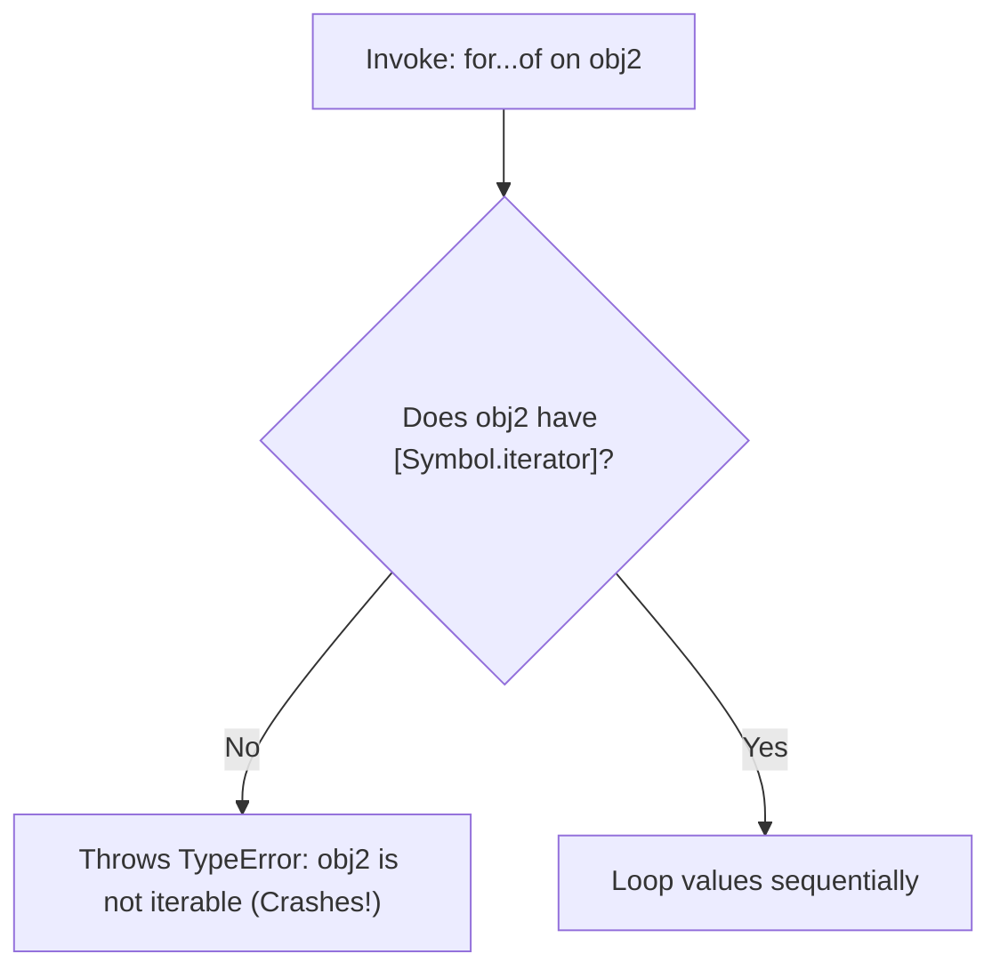
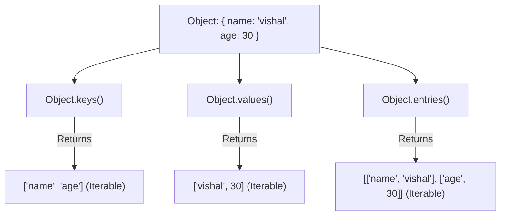

# JavaScript Array Traversal & Iteration: Complete Engineering Guide

This guide covers all aspects of navigating and traversing collections in JavaScript, detailing the execution mechanics of **standard `for` loops**, **`for...in` loops**, **`for...of` loops**, **`forEach`**, and **`map()`**, along with helper object methods (`Object.keys()`, `Object.values()`, and `Object.entries()`).

---

## Table of Contents
1. [Introduction to Traversal](#1-introduction-to-traversal)
2. [The 5 Core Traversal Methodologies](#2-the-5-core-traversal-methodologies)
3. [Deep Dive: The Standard `for` Loop](#3-deep-dive-the-standard-for-loop)
4. [Deep Dive: The `for...in` Loop](#4-deep-dive-the-forin-loop)
5. [Deep Dive: The `for...of` Loop](#5-deep-dive-the-forof-loop)
6. [Differences: `for...in` vs. `for...of`](#6-differences-forin-vs-forof)
7. [Object Traversal Techniques (Keys, Values, Entries)](#7-object-traversal-techniques-keys-values-entries)
8. [Critical Concepts: Iterable vs. Enumerable](#8-critical-concepts-iterable-vs-enumerable)
9. [Summary Checklist](#9-summary-checklist)

---

## 1. Introduction to Traversal

**Traversal** (or **Iteration**) in JavaScript refers to navigating through a data structure (like an array or object) element-by-element to access, inspect, or modify values. 

In JavaScript, arrays and objects have different internal descriptors that govern how loops interact with them. Understanding these descriptors is critical for technical interviews and performance-critical systems.

---

## 2. The 5 Core Traversal Methodologies

There are five primary ways to traverse or iterate through a JavaScript array:
1. **Standard `for` Loop:** Traditional index-controlled loop.
2. **`for...in` Loop:** Enumerable property key inspector.
3. **`for...of` Loop:** Iterable value navigator.
4. **`forEach` Loop:** Callback-driven sequential executor.
5. **`map()` Method:** Functional non-mutator transformer.

---

## 3. Deep Dive: The Standard `for` Loop

### A. Definition & Behavior
The standard `for` loop in JavaScript is a control flow statement that allows you to execute a block of code repeatedly based on an index count condition.
* It is used to repeat a section of code a specific number of times (i.e., iterating over the array length).
* **Performance:** This is the fastest traversal method because it performs simple index addition and boundary checks, allowing compiling engines (like V8) to highly optimize the execution block.

### B. Code Example
```javascript
const Names = [
  "Alice",
  "Bob",
  "Charlie",
  "Diana",
  "Edward",
  "Fiona",
  "George",
  "Hannah",
  "Ian",
  "Julia",
];

// Loop through each element sequentially from index 0 up to Names.length - 1
for (let i = 0; i < Names.length; i++) {
  console.log(Names[i]);
}
```

---

## 4. Deep Dive: The `for...in` Loop

### A. Definition & Behavior
The `for...in` loop is designed to iterate over the **enumerable properties (keys/indices)** of an object or array.
* **Returns Indices as Strings:** When used on an array, `for...in` returns the numeric index keys rather than the actual values. Crucially, these keys are returned as strings (e.g., `"0"`, `"1"`).
* **Prototype Leakage:** It traverses up the prototype chain, meaning it will list any custom properties added to `Array.prototype` or `Object.prototype` that are marked as enumerable.
* **Array Warning:** For these reasons, `for...in` is generally **avoided** for array traversal.

### B. Code Examples

#### Example 1: Iterating an Array with `for...in`
```javascript
// Iterating over the array index keys
for (let ele in Names) {
  console.log(ele); // Output: "0", "1", "2", "3", "4", "5", "6", "7", "8", "9"
}
```

#### Example 2: Iterating a Standard Object with `for...in`
A normal JavaScript object is an **enumerable object**, not an **iterable object**. `for...in` works perfectly to inspect its keys.
```javascript
const obj = { a: 1, b: 2, c: 3 }; 
for (let key in obj) {
  console.log(key); // Output: "a", "b", "c"
}
```

---

## 5. Deep Dive: The `for...of` Loop

### A. Definition & Behavior
The `for...of` loop was introduced in ES6 to iterate over the **values** of an **iterable object** (such as arrays, strings, Maps, Sets, or typed array buffers).
* **Uses Iterators:** It internally invokes the object's `[Symbol.iterator]` protocol.
* **Array-Friendly:** Unlike `for...in`, `for...of` yields the actual element values directly and ignores non-indexed object properties or prototype additions.

### B. Code Examples

#### Example 1: Iterating an Array with `for...of`
```javascript
for (let value of Names) {
  console.log(value); // Output: "Alice", "Bob", "Charlie", etc.
}
```

#### Example 2: The Non-Iterable Object Trap
If you attempt to use `for...of` directly on a standard object, a runtime error is thrown because objects lack the default iterator protocol.
```javascript
const obj2 = { a: 1, b: 2, c: 3 };

// UNCOMMENTING THIS WILL THROW A RUNTIME ERROR:
// for (let val of obj2) {
//   console.log(val); 
// }
// TypeError: obj2 is not iterable
```



---

### C. Shifting Non-Iterables into Iterables
To fix the object iteration error, you can use `Object` static utility methods to extract arrays (which are iterable) from the object:

#### Solution 1: Iterate over Values (`Object.values()`)
```javascript
for (let values of Object.values(obj2)) {
  console.log(values); // Output: 1, 2, 3
}
```

#### Solution 2: Iterate over Keys (`Object.keys()`)
```javascript
for (let keys of Object.keys(obj2)) {
  console.log(keys); // Output: "a", "b", "c"
}
```

#### Solution 3: Iterate over Entries (`Object.entries()`)
```javascript
for (let [key, value] of Object.entries(obj2)) {
  console.log(key, ":", value); // Output: "a : 1", "b : 2", "c : 3"
}
```

---

## 6. Differences: `for...in` vs. `for...of`

The table below contrasts these two looping statements, highlighting key traits evaluated during technical interviews:

| Feature | `for...in` Loop | `for...of` Loop |
| :--- | :--- | :--- |
| **Primary Target** | **Enumerable properties (keys/indices)**. | **Iterable values (elements)**. |
| **Common Use Case**| Iterating over plain object properties. | Iterating over arrays, strings, Maps, and Sets. |
| **Returned Value** | Property names (keys) as Strings. | Element values in their native data types. |
| **Plain Objects** | ✅ Works directly on plain objects. | ❌ Throws `TypeError` unless converted via Object keys/values. |
| **Prototype Chain**| Walks the prototype chain (includes inherited properties). | Ignores prototype properties entirely. |
| **Array Suitability**| ❌ Generally avoided due to index string conversion and prototype bugs. | ✅ Recommended for value-based sequential reads. |

```javascript
// Demonstration on an Array
const num = [1, 2, 3];

// for...in outputs index keys (as strings)
for (const key in num) {
  console.log("key:", key, typeof key); // Output: "0" string, "1" string, etc.
}

// for...of outputs values
for (const value of num) {
  console.log("value:", value); // Output: 1, 2, 3
}
```

---

## 7. Object Traversal Techniques (Keys, Values, Entries)

Standard JavaScript objects are not iterable by default, but they are enumerable. To traverse them using clean, modern loops, we utilize the following `Object` methods:



---

### A. `Object.keys()`
Returns an array containing the object's **own enumerable property names (keys)**.
```javascript
const person = {
  name: "vishal",
  age: 30,
  city: "junnar",
};

for (const key of Object.keys(person)) {
  console.log("Key:", key);
  console.log("Value:", person[key]); // Access values dynamically using square brackets
}
```

---

### B. `Object.values()`
Returns an array containing the object's **own enumerable property values**.
```javascript
for (const value of Object.values(person)) {
  console.log("Value:", value); // Output: "vishal", 30, "junnar"
}
```

---

### C. `Object.entries()`
Returns a nested array of the object's **own enumerable [key, value] pairs**. This is highly useful when both the property name and value are needed together.
```javascript
for (const [key, value] of Object.entries(person)) {
  console.log(`Property Name: ${key} | Property Value: ${value}`);
}
```

---

## 8. Critical Concepts: Iterable vs. Enumerable

One of the most frequent conceptual test points in senior-level interviews is explaining the difference between **Iterable** and **Enumerable**:

```
+-------------------------------------------------------------------------+
|                              OBJECT PROPERTIES                          |
+-------------------------------------------------------------------------+
|                                                                         |
|   1. Enumerable Property (Object Keys)                                  |
|      - Internal descriptor flag: { enumerable: true }                   |
|      - Visited by for...in loops.                                       |
|      - Plain objects are Enumerable by default.                         |
|                                                                         |
|   2. Iterable Property (Collection Iterators)                           |
|      - Internal protocol key: [Symbol.iterator] method                  |
|      - Visited by for...of loops.                                       |
|      - Arrays, strings, Maps, and Sets are Iterable by default.         |
|      - Plain objects are NOT Iterable.                                  |
|                                                                         |
+-------------------------------------------------------------------------+
```

1. **Enumerable:**
   * An internal flag (`enumerable: true`) on object properties.
   * If a property is enumerable, it will show up in `for...in` loops and `Object.keys()` arrays.
   * **Plain objects are Enumerable by default.**
2. **Iterable:**
   * An object is iterable if it defines a method at `[Symbol.iterator]` that returns an iterator object (with a `.next()` method).
   * **Arrays are both iterable and enumerable** (for their numerical indices).
   * **Plain objects are enumerable but NOT iterable by default.**

---

## 9. Summary Checklist

* **Use standard `for` loops** when index manipulations or high-performance speeds are critical.
* **Use `for...of` loops** when traversing values of arrays or list-like collections safely.
* **Avoid `for...in` loops** with arrays to prevent prototype leaks and type discrepancies.
* **Convert plain objects** into iterables using `Object.keys()`, `Object.values()`, or `Object.entries()` to perform modern value iterations.
